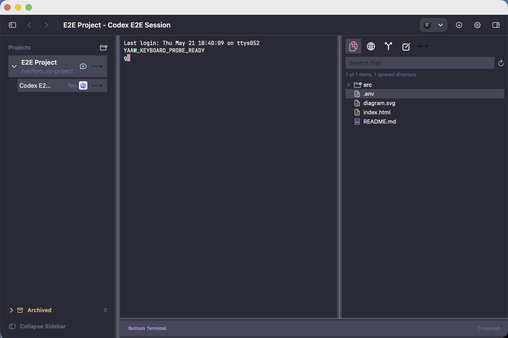

# Documentation

YAAW - Yet Another Agent Wrapper is a native macOS desktop wrapper for managing full-power local CLI agent sessions. Users bring their own preferred agent CLIs or agent CLI harnesses; YAAW augments them with project/thread organization, terminal surfaces, local tool panels, and opinionated macOS workflow defaults. It is terminal-first, `libghostty` backed, intentionally not an agent harness itself, and has no telemetry. Everything YAAW stores stays local on the user's device; remote behavior belongs to the user's chosen agent CLI.

Read the documentation in this order:

1. [Project README](../README.md)
2. [User Guide](user-guide/README.md)
3. [Technical Requirements](requirements/technical-requirements.md)
4. [Non-Functional Requirements](requirements/non-functional-requirements.md)
5. [Testing Requirements](requirements/testing-requirements.md)
6. [Design](design/README.md)
7. [Implementation Plans](plans/)
   - [Implementation Order](plans/implementation-order.md)
8. [Standards](standards/)
   - [Settings](standards/settings.md)
9. [Decisions](decisions/) — open product/architecture questions and the defaults plans assume until they are resolved.

Implementation plans should reference the relevant requirements and standards.

## Current Product Goals

- Keep YAAW a native macOS wrapper around user-owned local agent CLIs, not an agent harness.
- Bind each thread to exactly one `codex`, `claude`, `opencode`, or `copilot` CLI session and resume that session by stored identity.
- Keep project metadata, settings, file indexes, diagnostics, and activity previews in app-owned local storage.
- Use `libghostty` for terminal-backed work surfaces: agent sessions, bottom terminal, `nvim`, and Git.
- Keep the right panel focused on four local tools: Files, Browser previews, `nvim`, and Git.
- Preserve Dracula as the default visual system while supporting built-in theme, icon, font, keyboard, tool, and indexing settings.
- Prefer E2E behavior tests and screenshot artifacts over internals-heavy tests.

## Current Screenshot

The latest checked-in current-state screenshot is:

## GitHub Pages Site

The published documentation site is built by `.github/workflows/docs.yml`.
Durable docs remain in this `docs/` tree. The site-specific shell lives in
`docs/site/` and should be limited to layouts, CSS, config, and homepage
presentation.

Do not commit local Pages build output. `.pages/` and `_site/` are temporary
Jekyll staging directories and are ignored at the repo root.
